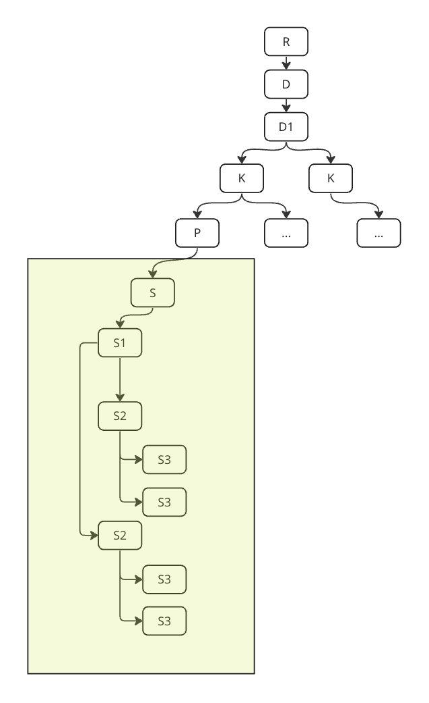

# KRAKEN2REF  

This python package identifies suitable reference genomes as well as reads that should be associated with that reference genome in downstream analysis, using the kraken2 taxonomic report as input. Briefly, it first finds all graphs in the report that are rooted at species level ("S"); then analyses the leaf nodes of these graphs to identify one or more of them as suitable reference genomes; and finally outputs information about each selected reference to pass on to downstream processes. (#TODO: potentially output json file?)  

# Quick Start  

## Installation  
#TODO: Will add container recipes ASAP

#### With pip  

```shell
pip install kraken2ref@git+ssh://git@gitlab.internal.sanger.ac.uk/malariagen1/misc_utils/kraken2ref.git
```  

#### From Source  

```shell
git clone https://gitlab.internal.sanger.ac.uk/malariagen1/misc_utils/kraken2ref.git
cd kraken2ref
pip install .
```  

Once installed, run as follows:  

```shell
kraken2r -i path/to/kraken2/report.txt -t min_read_threshold
```  

# List of Arguments  

- `-i` [path]: (ideally the absolute) path to kraken2 taxonomy report file [REQUIRED]  
- `-t` [int]: Minimum number of reads assigned to a leaf node for it to be considered [OPTIONAL][Default = 5]  

- `-h`: print help and exit  
- `-v`: print version and exit  

# Algorithm  

### Kraken2 Taxonomy Report  

Each line in the taxonomy report contains kraken2 output information for a single taxon; the information is presented with the following columns:  
1. **% of Reads Assigned**: The percentage of total reads assigned up to that taxon level  
2. **Cumulative #Reads Assigned**: The number of reads assigned up to that taxon level  
3. **#Reads Assigned**: The number of reads directly assigned to that taxon level  
4. **Taxon Level**: The short descriptor of taxonomic level (eg. "G" for Genus, "S" for Species, "S1" for sub-species or equivalent, etc)  
5. **Taxon ID**: The unique ID for that taxon  
6. **Descriptive Name**: The descriptive name of that taxon (eg. "Orthomyxoviridae", "Severe acute respiratory syndrome coronavirus 2")  

### Summary of the Kraken2 Read Assignment Algorithm  

Kraken2 depends on a database; the database contains a representation of the taxonomic tree/graph, and nucleotide sequences of the nodes in this tree/graph where available. Typically, sequence information is available for lower taxonomic levels, often only for what can be called leaf nodes in the taxonomic tree/graph; i.e. there is no single reference sequence for "Alphainfluenzavirus" but there do exist sequences for "Influenza A/H1N1/Isolate X".  

Briefly, once Kraken2 has a database set up, it attempts to assign each read in the input dataset to one of the taxonomic levels, starting at the leaf nodes. If a particular read could be assigned to more than one leaf node, then kraken2 instead assigns the read to the parent node of those leaf nodes. (Note that the parent node may or may not have actual sequence information associated with it in the kraken2 database.) This information is then summarised in the kraken2 taxonomy report as described above.  

For quick access to the contents of the kraken2 taxonomy report, we store salient information from it in a dictionary right at the start, where the keys are indexed nodes, and the value is a tuple containing that node's #Reads Directly Assigned and Taxonomic ID, before proceeding with the remainder of the process.  

##

In the context of viral data analysis pipelines, the root of the taxonomy tree/graph described in the kraken report will, of course, be the Domain "Viruses", with subtaxa following below. Since we expect kraken2 to virtually never encounter reads that can **only** be confidently assigned at very high taxonomic levels (any level higher than "Species", for example; see [here](#summary-of-the-kraken2-read-assignment-algorithm) and [here](https://github.com/DerrickWood/kraken2) for more), we start by "trimming" the taxonomy tree/graph to create one or more subtrees/subgraphs (in green, Fig. 1), each rooted at "Species" level and each extending to the leaf nodes in that branch of the graph.  

|  |
|:--:|
| *Figure 1: Example kraken2 Taxonomy* |  

In the example, we retain a subtree/subgraph where the nodes can be represented as a list:  

```python
nodes = ["S", "S1", "S2", "S3", "S3", "S2", "S3", "S3"]
```

Next, we parse this list of nodes to obtain the two subtrees/subgraphs in this one:  
```python
subgraph1 = ["S", "S1", "S2", "S3", "S3"]
subgraph2 = ["S", "S1", "S2", "S3", "S3"]
```  

Noting that the two look the same, the simple fix is to work with a list of *indexed* nodes, then find paths in this graph:  

```python
nodes = ["S", "S1", "S2", "S3", "S3", "S2", "S3", "S3"]
indexed_nodes = nodes = [(0,"S"), (1,"S1"), (2,"S2"), (3,"S3"), (4,"S3"), (5,"S2"), (6,"S3"), (7,"S3")]

## 0 --> 1 --> 2 --> (3,4)
subgraph1 = [(0,"S"), (1,"S1"), (2,"S2"), (3,"S3"), (4,"S3")]
paths1 = [[(0,"S"), (1,"S1"), (2,"S2"), (3,"S3")],
            [(0,"S"), (1,"S1"), (2,"S2"), (4,"S3")]]

## 0 --> 1 --> 5 --> (6,7)
subgraph2 = [(0,"S"), (1,"S1"), (5,"S2"), (6,"S3"), (7,"S3")]
paths2 = [[(0,"S"), (1,"S1"), (5,"S2"), (6,"S3")],
            [(0,"S"), (1,"S1"), (5,"S2"), (7,"S3")]]
```

##
> Note that the indices used to construct the data dictionary and by extension the nodes/graphs, correspond to the line indices in the kraken2 report -- this lets us use the outputs of this package to query the kraken2 report directly if ever we need to
##

Now, we can evaluate the leaf nodes of the graph `["S", "S1", "S2", "S3", "S3", "S2", "S3", "S3"]`, namely `[(3,"S3"), (4,"S3"), (6,"S3"), (7,"S3")]`, by checking the number of reads assigned to each of these leaf nodes by kraken2, using the data dictionary. Not all leaf nodes will pass the threshold number set by the user, and those paths through the graph will be discarded.  

##
> **NB:** In the current version, the algorithm is conservative and will output all non-spurious (i.e. all threshold-passing) paths through each graph in the kraken2 taxonomy report. Following versions will contain one or more ways to set up competition between leaf nodes to allow for more precise reference selection, taking advantage of the new taxonomy structure in the updated kraken2 database(s).   
##

In case no leaf nodes in a subgraph pass the threshold, the algorithm jumps up one taxonomic level; for example, in the graph `[(0,"S"), (1,"S1"), (5,"S2"), (6,"S3"), (7,"S3")]`, if neither `(6,"S3")` nor `(7,"S3")` have more than the threshold number of reads directly assigned, the output will identify this and note the parent, in this case `(5,"S2")`, as the stopping point.  

##
> This error is flagged on stderr and is searchable in case stderr is written to file: simply search for `NoSuitableTargetError` to find instances of this exception.  
##

In most cases, there is expected to be at least one leaf node which passes the threshold; for example, in the subgraph `[(0,"S"), (1,"S1"), (2,"S2"), (3,"S3"), (4,"S3")]`, let us say leaf `(4,"S3")` passes, giving us a valid path `[(0,"S"), (1,"S1"), (2,"S2"), (4,"S3")]` through this subgraph. At this point, the output notes `(4,"S3")` as the chosen reference, records the path to that node, and also records the taxonomic IDs of **ALL** nodes in the entire parent graph `[(0,"S"), (1,"S1"), (2,"S2"), (3,"S3"), (4,"S3")]` -- this allows us to retain all read information associated with this parent graph, and potentially use all those reads to align to/call consensus on/analyse with the chose reference.  

## Outputs  

Provisionally the outputs are summarised in a JSON file written by the program, which can be used by downstream processes. Potentially, main outputs could also be per-taxon FASTQ filepairs that can directly be fed to downstream applications.  

### TODO  
- [ ] Add outpath argument for JSON  
- [ ] Add log infor to JSON(?)  
- [ ] Select one or more polling methods  

