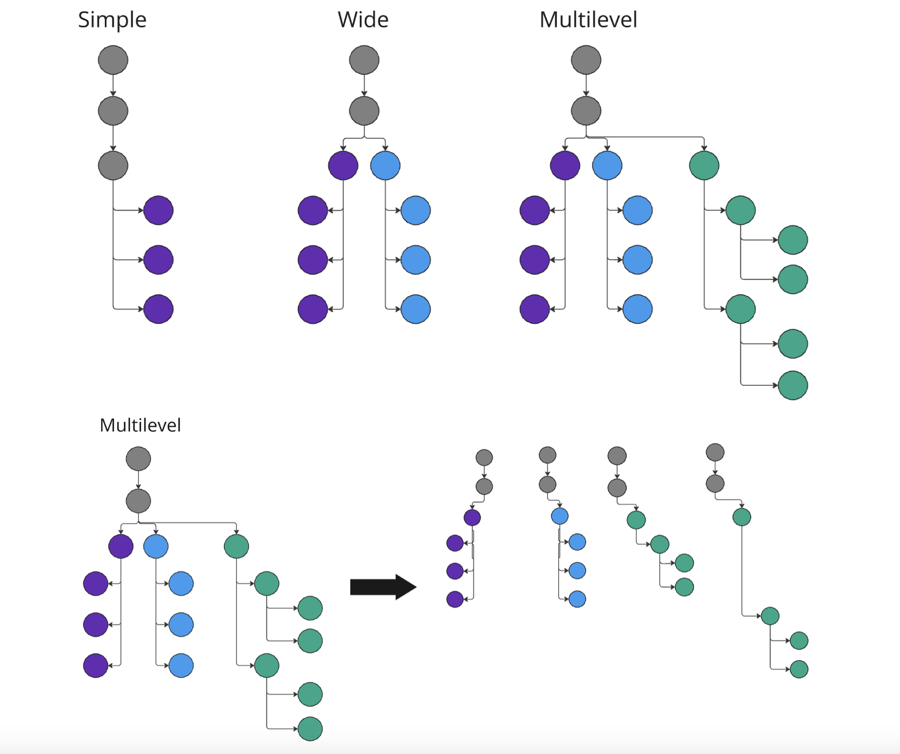

# KRAKEN2REF  

This python package identifies suitable reference genomes as well as reads that should be associated with that reference genome in downstream analysis, using the kraken2 taxonomic report as input. Briefly, it first finds all graphs in the report that are rooted at species level ("S"); then analyses the leaf nodes of these graphs to identify one or more of them as suitable reference genomes; and finally outputs information about each selected reference to pass on to downstream processes.  

## Installation  

#### With pip  

```shell
pip install kraken2ref@git+ssh://git@gitlab.internal.sanger.ac.uk/malariagen1/misc_utils/kraken2ref.git
```  

#### From Source  

```shell
git clone https://gitlab.internal.sanger.ac.uk/malariagen1/misc_utils/kraken2ref.git
cd kraken2ref
pip install .
```  

Once installed, run as follows:  
```shell
## parse kraken2 report
kraken2ref -s <sample_id> parse_report \
            -i path/to/kraken2/report.txt \
            -o ./ \
            -t <min_read_threshold> \
            -m max \
            -x decomposed \
            -q

## sort reads by reference (requires parse_report to have been run before if using tree mode)
kraken2ref -s <sample_id> sort_reads \
            -k path/to/output.kraken \
            -r path/to/kraken2ref.json \
            -m tree

## write per taxon fastq files loading the fastqs into memory
kraken2ref -s <sample_id> dump_fastqs
            -fq1 path/to/fq1.fq \
            -fq2 path/to/fq2.fq \
            --tax_to_readsid_path path/<sample_id>_tax_to_reads.json \
            --fq_load_mode "full" --max_threads <max_number_threads>

# or

## write per taxon fastq files loading the fastqs by chunks into memory
kraken2ref -s <sample_id> dump_fastqs
            -fq1 path/to/fq1.fq \
            -fq2 path/to/fq2.fq \
            --tax_to_readsid_path path/<sample_id>_tax_to_reads.json \
            --fq_load_mode "chunks" --chunk_size <number_of_reads> \

```  

## List of Arguments

- `-v` [switch]: Print version
- `-s` [str]: Sample ID [REQUIRED FOR BOTH MODES]  

### `parse_report` Mode

- `-i` [path]: (Ideally the absolute) path to kraken2 taxonomy report file [REQUIRED]  
- `-t` [int]: Minimum number of reads assigned to a leaf node for it to be considered [OPTIONAL][Default = 100]  
- `-o` [path]: Path to output directory [OPTIONAL][Default = "./"]  
- `-m` [str]: Polling method to use [OPTIONAL][DEFAULT = "max"]["max", "kmeans", "tiles", "skew"]  
- `-x` [str]: Suffix to apply to `sample_id` when creating output JSON file [OPTIONAL][Default = "decomposed"]  
- `-q` [switch]: Whether to log to stderr or not [OPTIONAL][Default = True]  

### `sort_reads` Mode

- `-k` [path]: Path to kraken2 output.kraken file [REQUIRED]  
- `-t` [str]: List of taxon IDs to extract [REQUIRED ONLY IF USING `-m unique`]  
- `-r` [path]: Path to JSON file produced by `kraken2r parse_report` [OPTIONAL ONLY IF USING `-m unique`]
- `-o` [path]: Path to output directory [Default = "path/to/ref_json"]  
- `-m` [str]: Specify sorting mode [OPTIONAL][DEFAULT = "unique"]  
- `-u` [switch]: Whether to update the JSON file produced by `kraken2r parse_report` inplace or produce a new, updated copy [OPTIONAL][Default: produce new][ONLY USED IF `-r` SPECIFIED]  
- `-c` [switch]: Whether to dump all reads for a species into one file-pair (as opposed to producing a file-pair _per reference_)[ONLY USED IF USING `-m tree`]  

### `dump_fastqs` Mode

- `-fq1` [path]: Path to R1 fastq file [REQUIRED]
- `-fq2` [path]: Path to R2 fastq file [REQUIRED]
- `-o` [path]: Path to output directory [Default = working dir]
- `-r` [path]: Path to JSON file produced by `kraken2r parse_report`
- `--max_threads` [int]: number of threads (default = 1, only used for `full` mode)
- `--fq_load_mode` [str]: load fqs file on memory mode. (default = "full") [full: (faster, but higher memory foorprint), chunks: (slower, lower memory footprint)]
- `--chunk_size` [int]: number of reads loaded into memory to process per batch (default = 10000)
- `--buffer_size` [int]: buffer for writing output fq files size in bytes (default = OS default buffer size)

### Kraken2 Taxonomy Report  

Each line in the taxonomy report contains kraken2 output information for a single taxon; the information is presented with the following columns:  
1. **% of Reads Assigned**: The percentage of total reads assigned up to that taxon level  
2. **Cumulative #Reads Assigned**: The number of reads assigned up to that taxon level  
3. **#Reads Assigned**: The number of reads directly assigned to that taxon level  
4. **Taxon Level**: The short descriptor of taxonomic level (eg. "G" for Genus, "S" for Species, "S1" for sub-species or equivalent, etc)  
5. **Taxon ID**: The unique ID for that taxon  
6. **Descriptive Name**: The descriptive name of that taxon (eg. "Orthomyxoviridae", "Severe acute respiratory syndrome coronavirus 2")  

> If running kraken2 with `--report-minimizer-info`, two columns are added to between "#Reads Assigned" and "Taxon Level". There are: "Total #Minimizers Assigned to Taxon" and "#Unique Minimizers Assigned to Taxon".  

### Summary of the Kraken2 Read Assignment Algorithm  

Kraken2 depends on a database; the database contains a representation of the taxonomic tree/graph, and nucleotide sequences of the nodes in this tree/graph where available. Typically, sequence information is available for lower taxonomic levels, often only for what can be called leaf nodes in the taxonomic tree/graph; i.e. there is no single reference sequence for "Alphainfluenzavirus" but there do exist sequences for "Influenza A/H1N1/Isolate X".  

Briefly, once Kraken2 has a database set up, it attempts to assign each read in the input dataset to one of the taxonomic levels, starting at the leaf nodes. If a particular read could be assigned to more than one leaf node, then kraken2 instead assigns the read to the parent node of those leaf nodes. (Note that the parent node may or may not have actual sequence information associated with it in the kraken2 database.) This information is then summarised in the kraken2 taxonomy report as described above.  

For quick access to the contents of the kraken2 taxonomy report, we store salient information from it in a dictionary right at the start, where the keys are indexed nodes, and the value is a tuple containing that node's #Reads Directly Assigned and Taxonomic ID, before proceeding with the remainder of the process.  

## Algorithm  

### `parse_report`  

In the context of viral data analysis pipelines, the root of the taxonomy tree/graph described in the kraken report will, of course, be the Domain "Viruses", with subtaxa following below. Since we expect kraken2 to virtually never encounter reads that can **only** be confidently assigned at very high taxonomic levels (any level higher than "Species", for example; see [here](#summary-of-the-kraken2-read-assignment-algorithm) and [here](https://github.com/DerrickWood/kraken2) for more), we start by "trimming" the taxonomy tree/graph to create one or more subtrees/subgraphs (in green, Fig. 1), each rooted at "Species" level and each extending to the leaf nodes in that branch of the graph.  

|  |
|:--:|
| *Figure 1: Example kraken2 Taxonomy* |  

In the example, we retain a subtree/subgraph where the nodes can be represented as a list:  

```python
nodes = ["S", "S1", "S2", "S3", "S3", "S2", "S3", "S3"]
```

Next, we parse this list of nodes to obtain the two subtrees/subgraphs in this one:  

```python
subgraph1 = ["S", "S1", "S2", "S3", "S3"]
subgraph2 = ["S", "S1", "S2", "S3", "S3"]
```  

Noting that the two look the same, the simple fix is to work with a list of *indexed* nodes, then find paths in this graph:  

```python
nodes = ["S", "S1", "S2", "S3", "S3", "S2", "S3", "S3"]
indexed_nodes = nodes = [(0,"S"), (1,"S1"), (2,"S2"), (3,"S3"), (4,"S3"), (5,"S2"), (6,"S3"), (7,"S3")]

## 0 --> 1 --> 2 --> (3,4)
subgraph1 = [(0,"S"), (1,"S1"), (2,"S2"), (3,"S3"), (4,"S3")]
paths1 = [[(0,"S"), (1,"S1"), (2,"S2"), (3,"S3")],
            [(0,"S"), (1,"S1"), (2,"S2"), (4,"S3")]]

## 0 --> 1 --> 5 --> (6,7)
subgraph2 = [(0,"S"), (1,"S1"), (5,"S2"), (6,"S3"), (7,"S3")]
paths2 = [[(0,"S"), (1,"S1"), (5,"S2"), (6,"S3")],
            [(0,"S"), (1,"S1"), (5,"S2"), (7,"S3")]]
```

> Note that the indices used to construct the data dictionary and by extension the nodes/graphs, correspond to the line indices in the kraken2 report -- this lets us use the outputs of this package to query the kraken2 report directly if ever we need to

Next, kraken2ref assesses the "complexity" of each Species-rooted tree in the kraken report. A simple tree is one which contains exactly one subterminal node -- as shown in the figure below, trees in the ARD viral_pipeline kraken DB may be "simple", "wide" (meaning more than one subterminal node, but all paths from root to leaf are the same length), and "complex" (meaning more than one subterminal node, but the various subterminals are at different depths in the tree). All trees are decomposed to their simple subtrees before being evaluated further.  

|  |
|:--:|
| *Figure 3: Possible Tree Structures* |  

Now, each simple sub-tree is passed into the driver workflow of kraken2ref. Briefly:  
- The leaf nodes are checked for the number of reads assigned to each one using the data dictionary  
- If no leaf nodes pass the threshold:  
    - kraken2ref checks the **cumulative** number of reads assigned to the subterminal
    - If this number passes the threshold:  
        - The leaf node with the maximum number of reads is passed on to the output
    - If this number does not pass the threshold:  
        - This subtree is discarded  
- If only one leaf node passes the threshold:  
    - That leaf node is passed to the output and no further processing is required for this subtree  
- If more than one leaf node passes the threshold:  
    - This set of leaf nodes is passed on to the polling function, and based on the selected polling method, one or more leaves are selected and promoted to output  
    > Note that by default, polling is simply the selection of the leaf node with the maximum number of reads assigned to it  

The output is summarised in a JSON file that has the following schema:  
```json
{
    "metadata": {
        //version string
        "k2r_version": string,
        //sample_id
        "sample": string,
        //timestamp format: yyyy-mm-dd hh:mm:ss
        "timestamp": string,
        //user-defined min read threshold
        "threshold": int,
        //list of selected taxids
        "selected": list(int)
    },
    "outputs": dict {
        //tax_id being summarised
        tax_id (string): {
            //index of "Species" line for this tree
            //corresponds to 0-indexed line0-number in kraken report
            "graph_idx": int,
            //Source node (idx, taxon-level)
            "source": list(int, string),
            //tax_id of source node
            "source_taxid": int,
            //Target node (idx, taxon-level)
            //corresponds to tax_id being summarised
            "target": list(int, string),
            //Whether tax_id being summarised is a subterminal
            "parent_selected": bool,
            //All tax_ids in this sub tree
            "all_taxa": list(int),
            //Path from root to leaf represented as a list of nodes
            "path": list(list(int, string)),
            //Path from root to leaf represented as list of tax_ids
            "path_as_taxids": list(int)
        }
    }
```

### `sort_reads` & `dump_fastqs`  

The `sort_reads` function takes as input the JSON file output by `parse_report` and summarises it in another JSON output. This JSON is formatted as follows:  
```json
{
    tax_id (string): list(string) //Read IDs associated with the key tax_id
}
```

This JSON is then taken as input for the `dump_fastqs` function, which writes:  
- One fastq filepair for each key tax_id in the `sort_reads` JSON
- A text file listing the read IDs that were not written to any fastq files  

## Polling  

### Maximum-Based Reference Selection  

As the name suggests, this method simply selects the leaf node with the maximum number of reads assigned to it. This is the default method that kraken2ref uses.  

### KMeans-Based Outlier Detection  

In this approach to outlier analysis, we use `sklearn.cluster`, specifically the `KMeans` module. Briefly, we conceptualise the list of references and their correspoding number of assigned reads as a frequency distribution. This frequency distribution is reshaped to a 2D `numpy` array so that `KMeans` can use it. Then, we "cluster" this distribution using `KMeans`, sort the frequenccies by their distance from the cluster centroid, and retain those outlier frequencies that are to the right of the median (i.e. those that are big numbers, rather than those that are outliers because they are small).  

|  |
|:--:|
| *Figure 2: KMeans-Based Outlier Analysis* |  

### Quantile-Based Outlier Detection  

In this approach, we use quartiles 1 and 3 (Q1 and Q3 respectively) to calculate the interquartile range (IQR) of the distribution, then we use these values to set up quantile "fences"; a "left fence": `Q1 - (1.5 x IQR)` and a "right fence": `Q3 + (1.5 x IQR)`. Finally, we retain frequences that lie beyond the "right fence".  

|  |
|:--:|
| *Figure 3: Quantile-Based Outlier Analysis* |  
